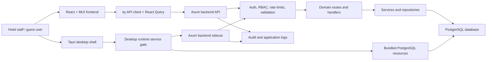

# Hotel app

<p align="center">
  <strong>A full-stack hotel administrative panel for reservations, rooms, guests, payments, ledgers, reports, and desktop operation.</strong>
</p>

<p align="center">
  <a href="https://github.com/siewong007/hotel-app/actions/workflows/ci.yml"></a>
  <a href="https://github.com/siewong007/hotel-app/actions/workflows/docker.yml"></a>
  <a href="LICENSE"></a>
  
  
  
</p>

<p align="center">
  
  
  
  
  
</p>

## 📌 Overview

Hotel app is a three-project monorepo for a hotel administrative panel. It combines a Rust backend API, a React administrative frontend, and a Tauri desktop wrapper that can run the application with bundled local services for offline-style operation.

The project is suitable as an academic or portfolio system because it demonstrates role-based access control, operational workflows, database-backed business records, reporting dashboards, and a deployable web/desktop architecture. It should be treated as an evolving project rather than a production-certified property management system.

## Problem Statement

Small hotel teams often need a single interface for front-desk operations, guest records, room status tracking, billing records, reports, and administrative permissions. Using disconnected spreadsheets or separate tools can make it difficult to keep bookings, room occupancy, payments, and audit records consistent.

This project addresses that problem by implementing a centralized administrative panel with a structured backend API, a browser-based operator interface, and a desktop packaging path for local use.

## Objectives

- Provide a unified interface for core hotel administration tasks.
- Maintain structured records for rooms, guests, bookings, payments, ledgers, audit logs, and reports.
- Demonstrate authenticated and permission-aware workflows using JWT, RBAC, 2FA, and passkey-related endpoints.
- Package the same frontend/backend system inside a Tauri desktop application.
- Keep the codebase organized enough for academic review, future refactoring, and open-source contribution.

## ✨ Key Features

| Area | Implemented capability |
| --- | --- |
| Authentication | Login, registration, token refresh, logout, email verification flow, 2FA, and passkey route support |
| Access control | RBAC roles, permissions, user-role assignment, and protected route guards |
| Bookings | Booking CRUD, check-in workflow, booking timeline, void/reactivation actions, and guest-linked bookings |
| Rooms | Room and room-type management, availability search, status changes, maintenance/cleaning events, and occupancy summaries |
| Guests | Guest profiles, linked guest accounts, guest booking history, upgrades, and credit-related records |
| Payments and invoices | Payment summaries, payment recording, deposit refund workflow, invoice preview, and invoice generation endpoints |
| Ledgers | Customer/company ledger records, ledger payments, summaries, voids, and reversals |
| Reports and analytics | Occupancy reports, booking analytics, benchmark-style report endpoint, generated reports, and personalized reports |
| Loyalty | Loyalty programs, memberships, points, rewards, redemptions, and member-facing reward views |
| eKYC and guest portal | Document upload, eKYC status/review endpoints, self check-in, and public pre-check-in guest portal routes |
| Administration | Settings, audit log browsing/export, night audit, complimentary stays, and data import/export |
| Desktop | Tauri shell, backend sidecar startup, bundled PostgreSQL lifecycle code, logs, and service status commands |

## Tech Stack

| Layer | Technologies |
| --- | --- |
| Backend API | Rust 1.95.0, Axum 0.8, Tokio, SQLx 0.8, Serde, Validator |
| Frontend | React 19, TypeScript 5.8, Vite 8, MUI v7, TanStack Router, TanStack Query, Zustand, ky |
| Desktop | Tauri 2, Rust commands, backend sidecar, bundled PostgreSQL resources |
| Database | PostgreSQL 19, SQLx migrations and parameterized queries |
| Security | JWT, refresh tokens, RBAC, TOTP 2FA, passkey endpoints, rate limiting, CORS, and security headers |
| Reporting | Recharts, jsPDF, jsPDF AutoTable, backend analytics endpoints |
| CI/CD | GitHub Actions for frontend typecheck/build and backend check/clippy/build; Docker image workflow for backend |

## 🧱 Architecture



The preferred backend flow is:

```text
routes/<domain>.rs -> handlers/<domain>/ -> services/<domain>/ -> repositories/<domain>/ -> models/<domain>/
```

The preferred frontend flow is:

```text
features/<domain>/pages -> components -> hooks -> api services -> shared API client
```

## Project Structure

```text
hotel-app/
├── hotel-app-be/                 # Rust backend API
│   ├── src/
│   │   ├── core/                 # Auth, database pool, errors, middleware, rate limiting
│   │   ├── handlers/             # HTTP handler functions
│   │   ├── models/               # DTOs and domain data models
│   │   ├── repositories/         # SQL persistence modules
│   │   ├── routes/               # Axum route registration by domain
│   │   ├── services/             # Business workflow logic
│   │   └── utils/                # Sanitization and validation helpers
│   ├── database/
│   │   └── postgres/             # V1 baseline, one-time data/seed, PG19 tuning
│   └── tests/                    # Focused backend tests
├── hotel-web-fe/                 # React frontend
│   ├── src/
│   │   ├── api/                  # ky-based API service layer
│   │   ├── auth/                 # Auth context and guards
│   │   ├── components/           # Shared UI components
│   │   ├── desktop/              # Tauri runtime API helpers
│   │   ├── features/             # Domain feature modules
│   │   ├── routes/               # TanStack file routes
│   │   └── utils/                # Shared frontend utilities
│   └── vite.config.ts            # Vite config and backend proxy prefixes
├── hotel-desktop/                # Tauri desktop application
│   ├── scripts/                  # Desktop resource sync and sidecar copy scripts
│   └── src-tauri/                # Tauri Rust commands, PostgreSQL lifecycle, config
├── infra/terraform/oci/          # Oracle Cloud Always Free development infrastructure
├── .github/workflows/            # CI and Docker workflows
└── README.md
```

## 🚀 Installation

### Docker Compose Quick Start

```bash
git clone https://github.com/siewong007/hotel-app.git
cd hotel-app
cp .env.example .env
# Edit .env — at minimum set JWT_SECRET and POSTGRES_PASSWORD

docker compose up -d
docker compose ps
curl http://localhost:3030/health
```

Services: frontend at `http://localhost:80`, backend API at `http://localhost:3030`, PostgreSQL at `localhost:5432`. An opt-in PostgreSQL 19 tuning profile is available via `make docker-up-pg19-tuned`.


## Environment Variables

| Variable | Used by | Required | Description |
| --- | --- | --- | --- |
| `DATABASE_URL` | Backend/Desktop sidecar | Yes | PostgreSQL connection string. |
| `JWT_SECRET` | Backend/Desktop sidecar | Yes | JWT signing secret; use at least 32 characters. |
| `BACKEND_PORT` | Backend/Desktop | No | API port, default `3030`. |
| `ALLOWED_ORIGINS` | Backend | No | Comma-separated CORS origins. |
| `VITE_API_URL` | Frontend | No | Optional build-time API-origin override. Leave unset for dynamic same-origin routing. |

Never commit real `.env` files or local credentials. Full variable reference: [hotel-app-be/.env.example](hotel-app-be/.env.example) and the [Deployment Guide](docs/guides/deployment.md#environment-configuration).

## Deployment Security Notes

See [SECURITY.md](SECURITY.md) and the [Deployment Guide's Security Checklist](docs/guides/deployment.md#security-checklist) before exposing this application beyond local development.

## 📡 API Endpoint Documentation

Representative endpoints are listed below; request/response shapes are documented in the route modules and DTOs under `hotel-app-be/src/models/`, the source of truth when integrating new clients. Health-check request examples are in the [Deployment Guide](docs/guides/deployment.md).

| Domain | Representative endpoints | Purpose |
| --- | --- | --- |
| Health | `GET /health`, `GET /ws/status` | Service status checks. |
| Authentication | `POST /auth/login`, `POST /auth/register`, `POST /auth/refresh`, `POST /auth/logout` | Account access and token lifecycle. |
| Two-factor auth | `POST /auth/2fa/setup`, `POST /auth/2fa/enable`, `GET /auth/2fa/status` | TOTP setup and verification workflows. |
| Passkeys | `POST /auth/passkey/register/start`, `POST /auth/passkey/login/start` | Passkey registration and login flow endpoints. |
| Profile | `GET /profile`, `PATCH /profile`, `POST /profile/password` | User profile and credential management. |
| RBAC | `GET /rbac/snapshot`, `GET /rbac/roles`, `GET /rbac/permissions`, `GET /rbac/users` | Roles, permissions, users, and assignments. |
| Bookings | `GET /bookings`, `POST /bookings`, `GET /bookings/{id}`, `PATCH /bookings/{id}` | Booking records and updates. |
| Booking operations | `POST /bookings/{id}/checkin`, `GET /bookings/{id}/timeline`, `POST /bookings/void` | Front-desk workflow actions. |
| Rooms | `GET /rooms`, `POST /rooms`, `PATCH /rooms/{id}`, `PUT /rooms/{id}/status` | Room inventory and status management. |
| Room types and rates | `GET /room-types`, `GET /rate-plans`, `GET /room-rates/applicable` | Configuration for room categories and pricing. |
| Guests | `GET /guests`, `POST /guests`, `PATCH /guests/{id}`, `GET /guests/{id}/bookings` | Guest records and history. |
| Payments | `GET /payments/calculate/{booking_id}`, `POST /payments/record-payment`, `POST /payments/refund-deposit/{booking_id}` | Payment calculations and recorded transactions. |
| Invoices | `GET /invoices/preview/{booking_id}`, `POST /invoices/generate/{booking_id}`, `GET /invoices` | Invoice preview and generation. |
| Ledgers | `GET /ledgers`, `POST /ledgers`, `GET /ledgers/summary`, `POST /ledgers/{id}/reverse` | Customer/company ledger management. |
| Loyalty | `GET /loyalty/programs`, `GET /loyalty/memberships`, `POST /loyalty/rewards/redeem` | Memberships, points, and rewards. |
| eKYC | `POST /ekyc/upload-document`, `POST /ekyc/submit`, `GET /ekyc/status`, `PATCH /ekyc/verifications/{id}` | Identity document submission and review. |
| Guest portal | `POST /guest-portal/verify`, `GET /guest-portal/booking/{token}`, `POST /guest-portal/pre-checkin/{token}` | Public guest pre-check-in workflow. |
| Analytics and reports | `GET /analytics/occupancy`, `GET /analytics/bookings`, `GET /reports/generate` | Reports, analytics, and generated report data. |
| Audit and settings | `GET /audit-logs`, `GET /settings`, `PATCH /settings/{key}` | Administrative observability and configuration. |
| Night audit | `GET /night-audit/preview`, `POST /night-audit/run`, `GET /night-audit/{id}` | End-of-day operational review. |
| Data transfer | `GET /data-transfer/export`, `POST /data-transfer/import` | Admin-only booking data export/import. |

Most operational endpoints require a bearer token and, in many cases, a specific RBAC permission.

## Repository Appearance Suggestions

Suggested GitHub repository description:

```text
Full-stack hotel administrative panel built with Rust, React, PostgreSQL, and Tauri.
```

Suggested topics:

```text
```

Logo/banner idea:

- A clean horizontal banner with a simple hotel-building icon, the title "Hotel app", and the subtitle "Administrative panel for hotel operations".
- Use a restrained palette such as deep navy, teal, and warm gold accents.
- Keep the banner readable at GitHub README width and avoid heavy gradients or overly detailed illustrations.

## 🗺️ Roadmap

### Completed ✓

- ✅ **Docker Compose full-stack setup** — One-command startup with PostgreSQL + backend + frontend
- ✅ **OCI Always Free Terraform** — Ampere A1 development VM, networking, Vault access, and Compose bootstrap
- ✅ **PostgreSQL 19 experiment profile** — Reversible server/schema tuning and benchmark scripts
- ✅ **Project Makefile** — Convenience commands for all development workflows
- ✅ **Frontend test suite** — Vitest + Testing Library component and utility tests
- ✅ **Backend service tests** — Rate limiter, booking service, and core utility tests
- ✅ **CI workflow fix** — Removed duplicate test step; frontend typecheck + lint + test enforced
- ✅ **Architecture Decision Records (ADRs)** — 11 documented architectural decisions
- ✅ **Deployment guide** — Comprehensive production deployment documentation
- ✅ **Contributing guide** — Updated with detailed guidelines, conventions, and testing instructions
- ✅ **Screenshots directory** — Placeholder structure for visual documentation
- ✅ **Security documentation** — Deployment security checklist and hardening guidelines

### Planned

- **OpenAPI/Swagger documentation** — Generate from backend route and model definitions
- **Distributed caching** — Replace in-memory RBAC/settings caches with Redis for multi-instance
- **Strict TypeScript mode** — Enable `strict: true` incrementally in tsconfig
- **Backend domain module migration** — Incremental move toward `modules/<domain>/` structure
- **Frontend component tests** — Expand coverage for major feature components
- **Desktop backup/restore** — Complete managed backup solution with recovery procedures

## Limitations

- The project is not presented as production-ready; security, compliance, deployment hardening, and operational procedures require additional validation.
- Frontend automated tests are still being expanded (utilities and select components covered; full feature coverage in progress).
- Some desktop operational commands are still limited; for example, database backup behavior is not a complete managed backup solution.
- eKYC document handling is implemented as an application workflow, not a certified identity verification service.
- API documentation is currently README-based rather than generated from a formal OpenAPI schema.
- Rate limiting and caching are in-memory only, which limits to single-instance deployments.

## Contributing

Contributions are welcome for bug fixes, documentation improvements, tests, and focused feature work. Please read the comprehensive [CONTRIBUTING.md](CONTRIBUTING.md) before opening a pull request, including its [Development Commands](CONTRIBUTING.md#development-commands) reference for per-project verification commands.

### Oracle Cloud Always Free

The development Terraform environment uses one Oracle Ampere A1 Flex VM for
the Compose stack and PostgreSQL. It defaults to 2 OCPU, 12 GB RAM, and a 50 GB
boot volume, with OCI Vault secret references and no paid managed database.

```bash
cd infra/terraform/oci/environments/dev
cp terraform.tfvars.example terraform.tfvars
terraform init
terraform plan
```

Review [the OCI Terraform guide](infra/terraform/oci/README.md) before applying.
PostgreSQL 19 is still beta and OCI Always Free has no production SLA, so this
environment is for development and benchmarking only.

## Additional Documentation

- [Architecture Flow](docs/architecture/architecture-flow.md) — Request flow through backend and frontend layers
- [Architecture Decision Records](docs/architecture/ADRS.md) — Documented architectural decisions
- [Deployment Guide](docs/guides/deployment.md) — Production deployment instructions
- [Database Lifecycle](hotel-app-be/database/README.md) — Schema, migrations, and seed data workflow
- [OCI Always Free Terraform](infra/terraform/oci/README.md) — Free-tier-shaped development environment

## License

This project is licensed under the [MIT License](LICENSE).

## Acknowledgements

- Rust, Axum, SQLx, Tokio, and the wider Rust ecosystem.
- React, TypeScript, Vite, MUI, TanStack Router, and TanStack Query.
- Tauri for enabling a desktop packaging path with a web frontend.
- University evaluators, reviewers, and open-source contributors who provide feedback on maintainability and project quality.
- Architecture Decision Records inspired by [Michael Nygard's ADR format](https://thinkmicroservices.com/blog/2024/01/14/architecture-decision-records.html).
