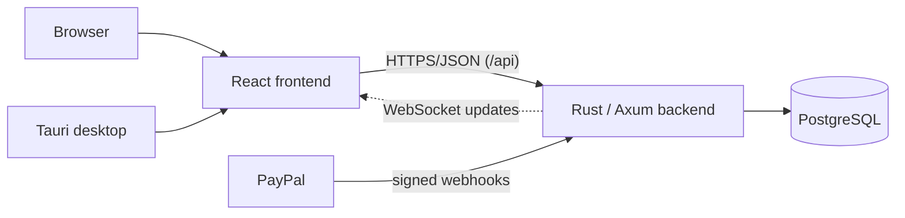

# Hotel Booking System

A hotel property management system covering reservations, rooms, housekeeping, rates,
payments, ledgers, invoicing, night audit, and a self-service guest portal where guests
can book without an account. It ships as a web application and as a Tauri desktop app
that bundles its own PostgreSQL. Three projects live in this repo — there is no root
workspace, so run commands from each subdirectory.

## Stack

| Layer | Technology |
|---|---|
| Frontend | React 19 + TypeScript (Vite, MUI, TanStack Query/Router) — Bun package manager |
| Backend | Rust + Axum (SQLx, Tokio) |
| Database | PostgreSQL 19 (`postgres:19beta3` image) |
| API | REST/JSON under `/api`; gRPC-Web (tonic) for a few domains behind runtime flags |
| Real-time | WebSocket (staff updates, loyalty, support) — no SSE endpoint |
| Authentication | JWT (in-memory access token + HttpOnly refresh cookie), RBAC, TOTP 2FA, passkeys |
| Payments | PayPal (signature-verified webhooks) + staff-recorded payments |
| Deployment | Docker Compose + Caddy (TLS), deployed by GitHub Actions |
| Desktop | Tauri 2 — backend sidecar + bundled PostgreSQL |

## Features

**Guests**

- Browse rooms and offers, check availability
- Book without an account (public, rate-limited endpoints)
- Manage the booking via a secure access token: guest portal, payments, eKYC document
  upload, self check-in

**Front desk**

- View reservations and arrival/departure rosters
- Check guests in/out; manage stay charges, deposits, and folio
- Assign and manage rooms, housekeeping, and maintenance
- Record payments, issue invoices, manage guest/city ledgers

**Admin**

- Hotel configuration, system settings, users, teams, RBAC roles/permissions
- Rooms, room types, rates, booking channels, promotions, loyalty
- Audit log, night audit, reports/insights, backup & restore (`hotel-backup` v1)

The canonical, per-feature delivery list is [docs/features.md](docs/features.md).

## Architecture



PostgreSQL is the single source of truth; the schema is a V1 baseline plus a
checksum-verified patch catalog (no migration runner). The browser talks to the backend
over HTTPS/JSON; WebSocket pushes real-time updates to staff screens (there is no SSE,
and WebTransport is not part of v1). gRPC-Web already serves a few domains behind
runtime flags and is being extended incrementally — REST remains the default everywhere
else. The desktop app runs the same frontend and backend, with the API as a localhost
sidecar against a bundled PostgreSQL.

## Project structure

```text
hotel-app-be/               # Rust backend API
  src/modules/<domain>/     # routes → handlers → service → repository → models
  src/core/                 # auth, DB pool, middleware, rate limiting
  database/postgres/        # 0001_v1_baseline.sql, seed.sql, patches/ catalog
  tests/                    # integration tests (most need DATABASE_URL)
hotel-web-fe/               # React frontend
  src/features/<domain>/    # pages, components, hooks, api
  src/api/                  # ky-based service layer + shared client
hotel-desktop/              # Tauri desktop app (sidecar backend + bundled PG)
proto/                      # gRPC contract of record (buf)
deploy/                     # prod/staging compose files, Caddyfile, deploy scripts
docs/                       # all documentation (index: docs/README.md)
infra/terraform/oci/        # OCI free-tier dev environment
Makefile                    # task runner — `make help`
```

## Getting started

Prerequisites: Rust 1.95.0 (pinned in `rust-toolchain.toml`), Bun 1.3, Docker.

**Option A — Docker (full stack):**

```bash
cp .env.example .env     # set POSTGRES_PASSWORD and JWT_SECRET — both ship blank and are required
docker compose up -d     # frontend :80, API :3030, Postgres :5432
curl http://localhost:3030/health
```

**Option B — local development:**

```bash
cd hotel-web-fe && bun install

cp .env.example .env                                   # set POSTGRES_PASSWORD (required by compose)
docker compose up -d postgres                          # 127.0.0.1:5432; auto-initializes schema on first boot
cp hotel-app-be/.env.example hotel-app-be/.env         # set DATABASE_URL and JWT_SECRET

cd hotel-app-be && cargo run --bin hotel-app-be        # API on :3030
cd hotel-web-fe && bun run start                       # Vite on :3000, proxies /api → 127.0.0.1:3030
```

Optional demo data: point `DATABASE_URL` at the dev database and run `make db-seed`.

**Database lifecycle** (no migration runner):

```bash
make db-baseline   # fresh DB: baseline + system seed + all patches (needs DATABASE_URL)
make db-patch      # converge an existing V1 database
make db-seed       # optional deterministic staging dataset
```

## Environment

| Variable | Required | Purpose |
|---|---|---|
| `POSTGRES_PASSWORD` | Docker Compose | DB password; ships blank — compose refuses to start without it |
| `JWT_SECRET` | Always | JWT signing secret, ≥ 32 chars; rotation invalidates staff tokens |
| `DATABASE_URL` | Backend outside Docker | e.g. `postgres://hotel_admin:<pw>@127.0.0.1:5432/hotel_management` |
| `ENVIRONMENT` | Production | `development`/`staging`/`production`; prod refuses insecure combos |
| `ALLOWED_ORIGINS` | Production | Comma-separated CORS origins (HTTPS, non-localhost in prod) |
| `BACKEND_PORT` | No | API port, default `3030` |

Compose reads the root [.env.example](.env.example); the full backend reference —
SMTP, PayPal, Turnstile, Google sign-in, pool tuning, all optional — is
[hotel-app-be/.env.example](hotel-app-be/.env.example). Never commit real `.env` files.

## Development

```bash
# Backend (hotel-app-be/)
cargo check --all-features                      # compile
cargo clippy --all-features -- -D warnings      # lint — the CI gate, verbatim
cargo fmt                                       # format
cargo test --all-features                       # needs DATABASE_URL or PG suites silently skip

# Frontend (hotel-web-fe/)
bun run typecheck && bun run lint:strict && bun run test && bun run build

# Root shortcuts
make check-all lint-all test-all
```

Schema changes go into the V1 baseline **and** a new checksum-verified patch under
`hotel-app-be/database/postgres/patches/` registered in `manifest.tsv` — a loose
`000N_*.sql` file is never executed. See
[hotel-app-be/database/README.md](hotel-app-be/database/README.md).

## Documentation

- [Feature registry](docs/features.md) — what exists, with per-feature delivery status
- [Architecture](docs/architecture/overview.md) · [ADRs](docs/architecture/decision-records.md) · [request/data flow](docs/architecture/system-flows.md)
- [API](docs/api/README.md) · generated [openapi.json](docs/api/openapi.json) (CI-enforced)
- [Development guide](docs/development.md) — setup, commands, troubleshooting
- [Database lifecycle](hotel-app-be/database/README.md)
- [Deployment](docs/guides/deployment.md) · [VPS access](docs/guides/vps-access.md)
- [Security](SECURITY.md) · [production operations](docs/security/production-operations.md)
- [Desktop packaging](docs/guides/desktop-packaging.md) · [updater](hotel-desktop/UPDATER.md)
- [Contributing](CONTRIBUTING.md)

## Status

- **Implemented:** everything marked *Delivered* in [docs/features.md](docs/features.md) —
  bookings, rooms, housekeeping, payments, ledgers, invoicing, night audit, eKYC, guest
  portal, loyalty, promotions, communications (email), i18n (en/ms/zh/zh-TW), and the
  desktop app.
- **In progress:** gRPC-Web migration (rooms, housekeeping, maintenance, guests done;
  ~350 REST paths remain); desktop OS signing/notarization (wired, awaiting
  certificates); PostgreSQL 19 GA cutover (currently on `19beta3`).
- **Planned:** SMS notification channel. PayPal refund/dispute webhooks are verified and
  audit-logged but not auto-applied — manual reconciliation today.

Assessed as *ready with conditions*, not fully production-ready — see the
[readiness assessment](docs/security/production-readiness-assessment.md).

## Important rules

- PostgreSQL is the source of truth; booking overlap is blocked by a database exclusion
  constraint — never bypass the booking transaction path.
- Shipped patches are immutable: add a new version, never edit one. Additive changes go
  in both the baseline and a registered patch.
- Parameterized SQL only; sanitize free text with the existing utilities; multi-step
  mutations run in transactions.
- Backend PG tests silently skip without `DATABASE_URL` and each skip counts as a pass —
  judge runs by wall-clock time, never by exit code or count alone.
- Changes land via PR on `master` with green CI; production deploys run only from
  `master`.

## License

[MIT](LICENSE)
