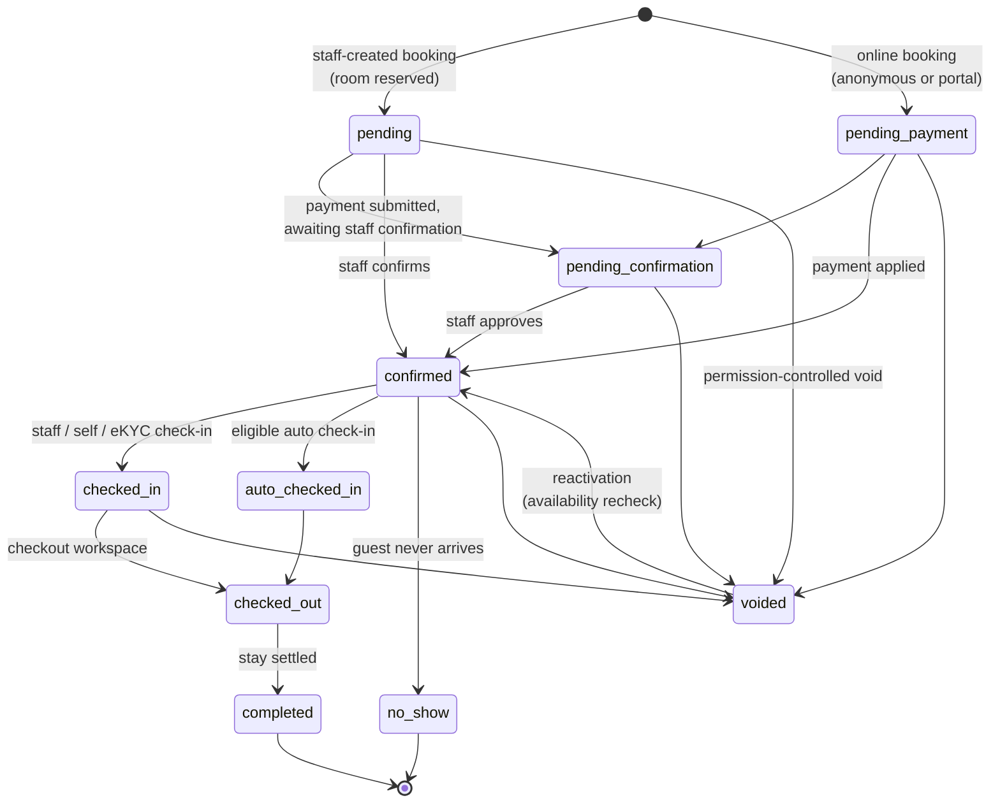
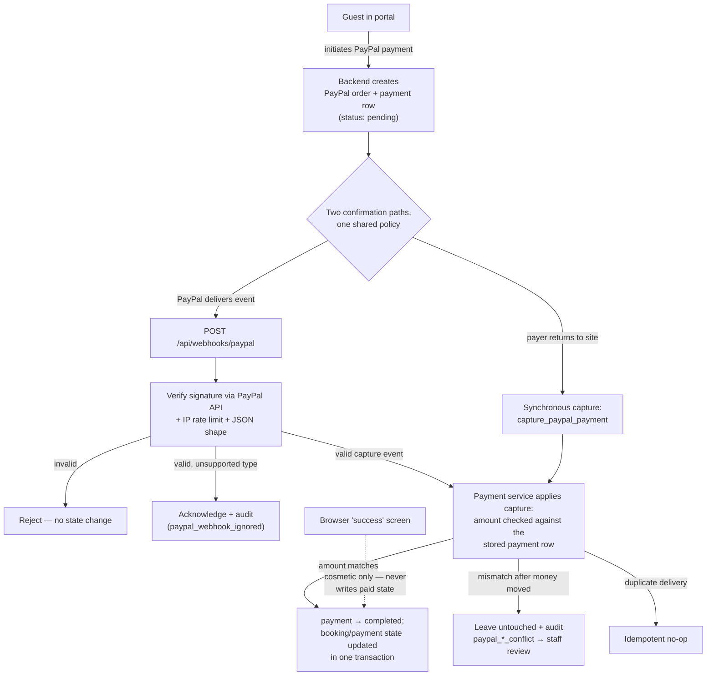
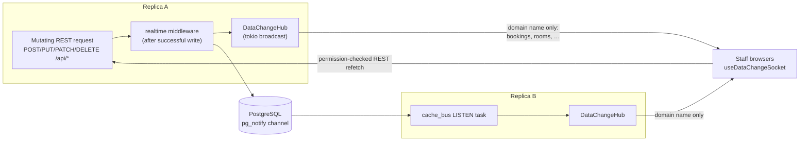

# System Flows

Decisions and rationale live in [decision-records.md](decision-records.md); deployment steps live in
[the deployment guide](../guides/deployment.md).

## Web request flow

```text
Browser (React / MUI / TanStack Router and Query)
  └─ src/api/client.ts (ky, bearer token, auth events)
      └─ Vite proxy in development or Caddy in production
          └─ Axum routes, CORS, rate limits, and security headers
              └─ authentication and permission checks
                  └─ handlers
                      └─ services
                          └─ repositories
                              └─ PostgreSQL
```

The same process also serves a second transport: tonic gRPC/gRPC-Web services
for rooms, room types, housekeeping, maintenance, and guests, mounted at
root-level paths (`/hotel.<package>.<Service>/<Method>`) and wrapped in
`tonic_web::GrpcWebLayer` so browser Connect clients share the port with no
proxy sidecar. Browser use is opt-in per context via
`hotel-web-fe/src/api/grpc/flags.ts` (`VITE_GRPC_CONTEXTS` build default,
per-browser `grpcContexts` override); a disabled context keeps calling REST.
The Vite dev proxy forwards `/hotel.`; the production edge matchers
(`deploy/Caddyfile`, `deploy/deploy{,-staging}.sh`) do not yet — the flags
therefore stay off outside development (ADR 014,
[grpc-migration/](grpc-migration/)).

## Desktop flow

```text
Tauri webview
  └─ Tauri IPC and backend-ready event
      └─ backend sidecar on a dynamically selected localhost port
          └─ bundled PostgreSQL runtime and resources
```

Desktop mode sets `HOTEL_DESKTOP_MODE`. The webview obtains the selected backend
port through Tauri IPC. The sidecar receives an explicit `ALLOWED_ORIGINS` list.

## PostgreSQL V1 lifecycle

A new empty database is initialized exactly once; an ordered patch catalog
carries any later schema changes (the original 1.2–1.23 lineage was folded
into the baseline and the catalog republished from empty — see
`patches/manifest.tsv` for the current entries):

```text
database/postgres/migrations/0001_v1_baseline.sql
  → database/postgres/seed.sql
      → database/postgres/patches/ (manifest.tsv, in version order)
```

Docker, server, and desktop deployments share this sequence. Legacy databases
must be exported and rebuilt rather than upgraded in place.

An additive change lands in **two** places every time: the baseline (fresh
installs) and a new catalog patch (databases already on V1). Only files listed
in `patches/manifest.tsv` are ever executed, only in manifest order, and only
through a catalog executor that verifies each file's recorded `sha256:`
checksum first. Published versions and checksums are immutable — a patch that
needs to change gets a new version, never an edit.

Each patch runs as `_begin.sql` + the patch + `_end.sql` in one transaction: an
advisory lock serializes concurrent runners, a guard aborts unless the recorded
V1 baseline checksum is the supported one, an already-recorded revision is
skipped via `\if`, and the DDL commits together with its `hotel_schema_revisions`
row. There is no partially applied patch, and a rerun is a no-op.

| Context | Application point |
|---|---|
| Server / local | `make db-patch` (also the last step of `make db-baseline`) |
| Production deploy | `deploy/deploy.sh` — after the verified backup, after PostgreSQL alone is up, before the application containers are activated |
| Desktop | the Tauri launcher (`src-tauri/src/postgres/patches.rs`), after it recognizes a fresh or V1 database and before it starts the backend sidecar |
| Backend startup | never — it validates the schema and refuses layouts it does not recognize |

`make db-schema-drift` compares a target database against a scratch
current-baseline database read-only (`report-schema-drift.sh` +
`schema-inventory.sql`); exit 2 means the schemas differ.

Full lifecycle reference, including failure recovery:
[database README](../../hotel-app-be/database/README.md).

## Reservation lifecycle

The booking `status` vocabulary is wider than a simple
PENDING → CONFIRMED → CHECKED_IN → CHECKED_OUT sketch — the dedicated
transitions below map onto it, and staff with the booking permission can also
move a booking through the edit path:



- `pending`, `pending_payment`, `pending_confirmation`, `confirmed`,
  `checked_in`, and `auto_checked_in` are the **overlap-blocking** statuses —
  the `bookings_no_room_date_overlap` exclusion constraint covers exactly
  these, so two active bookings can never share a room's date range.
- `voided` bookings reverse their payment/loyalty effects; reactivation goes
  back through `confirmed` and re-reserves a room after a fresh availability
  check.
- `comp_void`, `partial_complimentary`, and `fully_complimentary` record the
  complimentary-stay variants alongside the main flow.
- Voiding from an in-house state (`checked_in`/`auto_checked_in`) exists for
  corrections; the normal path voids before arrival.

## Anonymous online booking

Guests book without an account through `modules/guest_booking` — public
`GET /api/booking/offers`, `GET /api/booking/room-types`,
`POST /api/booking/quote`, and `POST /api/booking/reservations` are
unauthenticated by design and rate-limited by origin IP. Public pricing is
list-price only; vouchers, credits, and loyalty stay behind the authenticated
`/api/guest-portal/me/*` variants.

```mermaid
sequenceDiagram
    participant Guest
    participant API as guest_booking service
    participant DB as PostgreSQL

    Guest->>API: POST /api/booking/reservations
    API->>API: generate access token (256-bit)
    API->>DB: BEGIN
    API->>DB: recheck online availability + allocate room<br/>(FOR UPDATE SKIP LOCKED)
    API->>DB: insert anonymous guest + booking (pending_payment)
    API->>DB: persist SHA-256 hash of access token
    API->>DB: mark room reserved + history (source: anonymous)
    API->>DB: COMMIT — bookings_no_room_date_overlap guards the range
    API-->>Guest: booking_number + raw access token (shown once)
    Guest->>API: /api/guest-portal/me/* (bearer token)
    API->>DB: SHA-256(token) lookup; expiry vs stay dates
```

- The booking **number is not a credential** — the raw token is a random
  secret, stored only as a SHA-256 hash, expiring relative to the stay.
- A separate recovery path (`verify_guest_booking`) looks a booking up by
  number + guest name and mints a distinct 48-hour **pre-check-in** token —
  that initial lookup intentionally still relies on booking number + name.
- `claim_account` upgrades the anonymous guest record into a real portal
  account later, so accounts are never mandatory for the first booking.

## Payments and PayPal webhooks

Two capture paths converge on one policy: the synchronous capture
(`modules/payments/service.rs::capture_paypal_payment`) and the inbound webhook
(`/api/webhooks/paypal` → `modules/webhooks/routes.rs` → `modules/webhooks/handlers.rs`). Both
verify the captured amount against the stored payment row — never the editable
booking total. On a mismatch after money has moved they write a
`paypal_capture_conflict` / `paypal_webhook_conflict` audit event and leave the
payment untouched for staff review; a payment is only marked failed when money
never moved. Webhook routes carry no bearer auth by design — each delivery is
cryptographically verified and IP rate-limited; unhandled event types are
audit-logged as `paypal_webhook_ignored` and acknowledged. Conflicts surface on
the admin Payment Approvals page via `GET /api/admin/payments/paypal-conflicts`
(`payments:read`).
Payments RBAC lives at the route layer: every wrapper in `modules/payments/routes.rs`
calls `require_permission_helper` before its handler.



## Payment idempotency and deposit refunds

Staff-created booking and ledger payments require a client-generated
idempotency key. The write path locks the parent booking or ledger `FOR UPDATE`
before reading its balance, persists the key plus a canonical SHA-256
`idempotency_fingerprint` of the material request fields, and is backed by
partial unique indexes on `(booking_id, idempotency_key)` and
`(ledger_id, idempotency_key)`. An exact replay returns the original payment;
the same key with different payment data is a conflict. Several legitimate
partial/installment payments per charge remain supported. A company payment
allocates across ledger entries in one transaction — all or nothing. Ledger
receipt uniqueness is scoped to `(ledger_id, lower(trim(receipt_number)))`, so
one real company receipt can be allocated across several entries.

Frontend callers hold an idempotency attempt until **every** step that can throw
has succeeded, so a failed post-payment refetch replays server-side instead of
minting a new key and charging twice.

`PaymentRepository::refund_deposit` bounds a keycard-deposit refund by the
deposit actually held: inside the refund transaction it locks the booking and
takes `bookings.deposit_amount` when `deposit_paid` is true and positive,
otherwise the sum of completed `deposit` payments — alternatives, never additive.
A missing or exceeded deposit is rejected; the one-refund-per-booking rule and
partial refunds are unchanged.

### Checkout deposit guard

`ensure_checkout_balance_resolved` (`modules/bookings/lifecycle.rs`) gates every
`checked_out`/`completed` transition through `update_booking_handler` — the
single entry point the Bookings page, Rooms grid, ledger view and direct API
calls all funnel through. Two independent conditions must hold:

- **Billable balance settled.** `billable_total` minus the workflow summary's
  `total_paid` (which excludes deposits — collateral, not charge payment) must
  be zero, *unless* company billing carries the remainder to the city ledger.
- **Held deposit resolved** — refunded, forfeited, or waived. Unlike the
  balance check, this one is **not** exempted by company billing: a corporate
  booking can still hold a keycard deposit.

Both read pre-update state at the call site, so resolution must be a prior
call — a payment or waive folded into the checkout request itself does not
satisfy either guard.

The held amount is the larger of the payments ledger's recorded deposits and
the `bookings.deposit_{paid,amount}` mirror. The mirror exists because a legacy
booking can assert a deposit with no payment rows behind it; it can only *add*
a block, never mint refundable money — refund, forfeit and waive all still
resolve through the ledger. The frontend derives the same lifecycle in
`features/invoices/hooks/useDepositResolution.ts` for the checkout invoice.

## Ledger reporting

`customer_ledgers` responses and the Company Ledger statement carry the linked
booking's `check_in_date` / `check_out_date`, resolved from
`customer_ledgers.booking_id`. The fields are nullable — a standalone ledger
entry with no booking renders `-` — and no ledger amount, total, filter, or
status logic depends on them.

## Hotel business day

The hotel timezone lives in `system_settings.timezone` and is applied to every
pooled connection (`core/db.rs`), so SQL `CURRENT_DATE` is the hotel business
day. Rust code must use `core/db.rs::hotel_today(executor)` for business-day
decisions (due dates, occupancy gating, report windows) — never
`chrono::Local`/`Utc` date math.

## Revenue attribution and promotion pricing

- `bookings.booking_channel_id` (FK → `booking_channels`) is the canonical
  booking-source attribution for revenue reporting. `bookings.source` and
  `bookings.channel` are legacy free-text varchars — displayed as entered,
  never used for analytics. `bookings.net_revenue` stores the post-commission
  amount computed at write time.
- Promotion → booking attribution runs through `voucher_redemptions`
  (promotion_id, booking_id, gross/discount/net). `voucher_redemption_allocations`
  spreads each redemption across stay nights; per-night `discount_amount`
  combines the complimentary-credit share and the voucher share so the rows
  always reconcile with the parent redemption.
- All discount math lives in `modules/promotions/pricing.rs`
  (`calculate_promotion_pricing`) — the single engine used by guest-booking
  quotes and redemption writes. Do not reimplement percentage/fixed discount
  math elsewhere.

## Guest relations

The staff CRM workspace (`modules/guest_relations/`, `/guest-relations`)
is a join surface over the canonical `guests` identity — interactions,
preferences, reviews, loyalty, vouchers, support, and communications read under
one `/guests/{id}` tree without owning those domains. Boundary table, identity
model, endpoint/permission map (incl. `guests:reveal` for sensitive
identifiers): [guest-relations.md](guest-relations.md).

## Guest portal security

Pre-checkin tokens are 256-bit (`generate_session_token`) and invalidated on
submit; the portal has logout/revoke and `/api/guest-portal/me/*` is rate-limited.
Every portal mutation writes an audit event. Portal booking creation is
race-safe: `lock_room_type_tx` (`FOR UPDATE`) plus `allocate_room_tx`
(`FOR UPDATE SKIP LOCKED`) guarantee a single winner for the last room.

## Communications (email)

`modules/communications/`: SMTP via lettre (delivery worker spawned in
`main.rs` when `SMTP_*` env vars are set), campaign scheduler, per-guest
notification preferences (`/guest-portal/me/notification-preferences`), and
booking-confirmation deliveries queued from the guest-booking and payment
paths.

## Guest segments

`guest_segments` stores named JSONB rule sets (`{groups: [{conditions}]}`
— OR between groups, AND within). `modules/segments/rules.rs` compiles them
into parameterized predicates over `guests` (whitelisted fields/operators;
only values are bound). Membership is always evaluated live — there is no
materialized member table.

`email_campaigns.segment_id` intersects the compiled predicate with the
existing audience gates (active guest, valid email, topic subscription,
suppression list, per-campaign delivery dedup). Preview counts and the
scheduler's expansion share the same `SegmentScope` resolution: a missing
or inactive segment fails closed to zero recipients rather than widening
to the untargeted audience. Segments referenced by campaigns cannot be
deleted (`ON DELETE RESTRICT` + a service-level conflict) — deactivate them.

## Realtime resilience

Real-time updates use **WebSocket**, not SSE (ADR 015). The staff data-change
socket (`GET /api/updates/socket`) upgrades with the access token carried in
`Sec-WebSocket-Protocol`; session validity is checked before the upgrade.
Other hubs follow the same pattern (`/api/admin/loyalty/socket`,
`/api/guest-portal/me/loyalty/socket`, `/api/guest-portal/me/support/socket`,
`/api/guest-portal/me/availability`).



The socket payload is only a domain name — it carries no records, so it can
never leak data a client is not authorized to read; clients refetch through
their normal permission-checked queries. WebSocket hubs log lagged-drop counts;
frontend sockets reconnect with capped exponential backoff plus jitter; the
HTTP client honors `Retry-After` on 413/429/503.

## Important wiring checks

- Merge every new backend router in `routes/mod.rs`.
- Add new top-level API prefixes to `hotel-web-fe/vite.config.ts`.
- Register new pages in both `src/routes/` and `src/navigation/routeRegistry.tsx`.
- Keep SQL parameterized and validate it against PostgreSQL.
